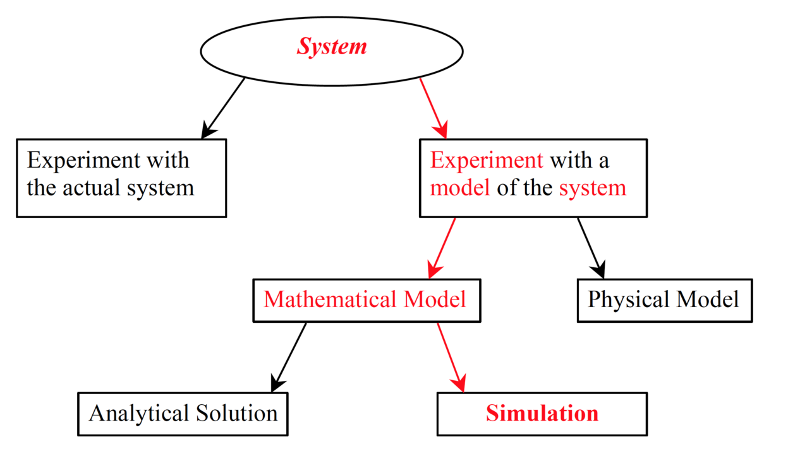
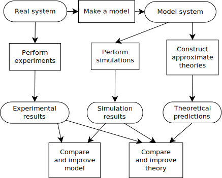
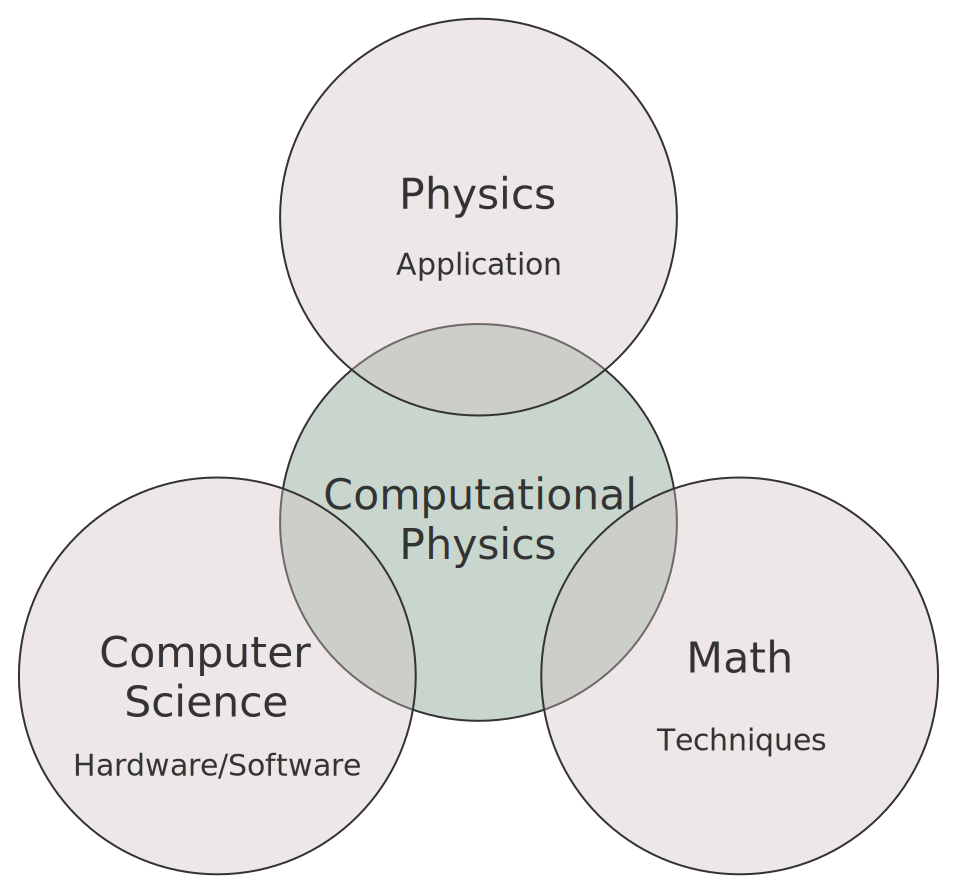

# Комп'ютерна Фізика

В час коли світ з нетерпінням чекає квантових компютерів, лишній раз акцентувати увагу на важливості застосування компютерів немає. Цей факт для фізики теж не вийняток. 

Тема є великою, як і в історичній перспективі, так і дуже об'ємна. Тож спочатку про об'єм, а саме про ці всі речі, які ховаються за терміном - Комп'ютерна фізика, отже..

## Вступ і деякі ключові поняття

### [Обчислювальна наука](https://en.wikipedia.org/wiki/Computational_science)

Це мультидисциплінарна наука, яка використовує компютерні потужності\можливості для розуміння і розвязку складних завданнь. Завдання можуть можуть бути найрізноматніші, але всі вони в своїй основі зводяться до побудови симуляцій і моделей для розуміння натуральних систем.

На практиці, це зазвичай застосування [компютерної симуляції](https://en.wikipedia.org/wiki/Computer_simulation) і інших форм обчислень і чисельних методів для розвязання задач в різноманітних наукових дисциплінах. Цей підхід відрізняється від традиційного експерименту, тому що, знання добувається через аналіз математичних моделей реалізованих на компютері.

#### Шляхи вивчення системи:

Автор: Jonathanjeroen, [джерело](https://en.wikipedia.org/wiki/Computational_science#/media/File:Ways_to_study_a_system.png), ліцензія [CC BY-SA 4.0](https://creativecommons.org/licenses/by-sa/4.0)

Обчислювальна наука широко розпізнається, як третя форма науки, поміж ексеприментальною і теоретичною науками. Обчислювальна наука повинна бути спроможною:

+ Реальність поставленої задачі.
+ Адекватно __концептуалізувати__ систему.
+ __Дизайн__ каркасу __алгоритмів__ для даної системи.
+ __Вибрати__ відповідну __інфраструктуру__: паралельні обчислення, кластерні обчислення чи суперкомпютери.
+ __Максимізувати__ обчислювальну __швидкість__.
+ __Валідація__ вихідних даних і границі застосування моделі.

#### Застосування:

+ Інфраструктура міста.
+ Фінанси.
+ Біологія.
+ [Теорія складних систем](https://en.wikipedia.org/wiki/Complex_systems).

та інші.

#### Методи та алгоритми

+ [Компютерна алгебра](https://en.wikipedia.org/wiki/Computer_algebra).
+ [Чисельний аналіз](https://en.wikipedia.org/wiki/Numerical_analysis):
  + Ряди Тейлора.
  + [Автоматичне диференціювання](https://en.wikipedia.org/wiki/Automatic_differentiation).
  + [Метод скінченних елементів](https://en.wikipedia.org/wiki/Finite_element_method) для розвязання рівняннь в частинних похідних.
  + [Чисельне інтегрування](https://en.wikipedia.org/wiki/Methods_of_integration).
  + [Метод Рунге — Кутти](https://en.wikipedia.org/wiki/Runge%E2%80%93Kutta_methods).
  + [Метод Ньютона](https://en.wikipedia.org/wiki/Newton%27s_method).
+ [Дискретне перетворення Ферє](https://en.wikipedia.org/wiki/Discrete_Fourier_transform).
+ [Метод Монте-Карло](https://en.wikipedia.org/wiki/Monte_Carlo_method).
+ [Чисельна лінійна алгебра](https://en.wikipedia.org/wiki/Numerical_linear_algebra).
+ [Лінійне програмування](https://en.wikipedia.org/wiki/Numerical_linear_algebra).
  + Branch and cut.
  + Branch and bound.
+ [Числові методи для звичайних диференціальних рівнянь](https://en.wikipedia.org/wiki/Numerical_methods_for_ordinary_differential_equations).

Та багато інших.

### [Компютерна симуляція](https://en.wikipedia.org/wiki/Computer_simulation)

Це відтворення поведінки системи з допомогою компютера базуючись на математичній моделі даної системи.

автор: [Danski14](https://commons.wikimedia.org/wiki/User:Danski14), [джерело](https://en.wikipedia.org/wiki/Computer_simulation#/media/File:Molecular_simulation_process.svg), ліцензія [CC BY-SA 3.0](https://creativecommons.org/licenses/by-sa/3.0)

#### Історія

Першою компютерною симуляцією історично була, симуляція твердих кульок методом монтекарло, для [Мангетенського Проєкту](https://en.wikipedia.org/wiki/Manhattan_Project).

#### Типи

Компютерні симуляції можуть бути класифіковані згідно з декількома незалежними парами характеристик:

+ __Стохастина__ або __детерміністична__.
+ __Статична__ або __динамічна__ система.
+ __Неперервна__ або __дискретна__(і важливий спеціальний випадок - __дискретноподійна__).
+ Симуляція динамічної системи. Це симуляція систем, які описуються:
    + Механічні системи які описуються з допомогою [диференційноалгебраїчних систем рівняннь](https://en.wikipedia.org/wiki/Differential-algebraic_system_of_equations).
    + [Обчислювальна гідродинаміка](https://en.wikipedia.org/wiki/Computational_fluid_dynamics) з використанням [FEM](https://en.wikipedia.org/wiki/Finite_element_method)(які описуються в свою чергу з допомогою [диференційних рівняннь в частинних похідних](https://en.wikipedia.org/wiki/Differential-algebraic_system_of_equations)).
+ __Локальні__ і __розподілені__.

Інший спосіб класифікації симуляції - це глянути на структуру даних, що лежить в основі, є два основних класи:

+ Симуляції, які зберігають дані в регулярній сітці і потребують доступ, лише до сусідніх елементів, називаються [__Код трафарету__](https://en.wikipedia.org/wiki/Stencil_code). Багато FEM моделей належать до цього класу.
+ Якщо структура даних в основі - не регулярна, тоді модель належить до [__Безсіткових__ методів](https://en.wikipedia.org/wiki/Meshfree_methods).

#### Підводні камені

Для виконання точної симуляції, наступні три кроки повинні бути виконані:

+ Калібрація. Резльтати симуляції повинні відповідати тому, що відомо з експерименту, або теорії.
+ Верифікація. Перевірка, що модель поводиться "добре" в залежності від вхідних даних.
+ Валідація. Порівняння моделі з історичними даними.

### [Компютерна фізика](https://en.wikipedia.org/wiki/Computational_physics)

Це наука і імплементація чисельних методів для розвязку задач фізики, для яких кількісна теорія вже розроблена. Історично, компютерна фізика була першим застосуванням компютероних обчисленнь для фізики. Тепер компютерна фізика, підгалузь компютерних наук.

Також її розглядають як ще одна ланка з поміж експерименту і теорії.

Фізичні теорії повсюдно описуються матемтаичними моделями, та нажаль явний розвязок є рідко доступним. Використання чисельних методів, дає змогу розвязати неявні задачі, натомість приходиться мати справу із [неточністю заокруглення](https://en.wikipedia.org/wiki/Approximation_error).

Автор [Nicoguaro](https://commons.wikimedia.org/wiki/User:Nicoguaro), [джерело](https://en.wikipedia.org/wiki/Computational_physics#/media/File:Computational_physics_diagram.svg),  Ліцензія [CC0](http://creativecommons.org/publicdomain/zero/1.0/deed.en).

#### Виклики компютерної фізики

В загальному проблеми компютериної фізики є складними. Ця складність є наслідком браку матемматичних розвязків комплексності динамічних систем та хаосу.

На приклад, навіть ефект Штарка з квантової механіки, є надзвичайно складним. Також складність [проблеми багатьох тіл](https://en.wikipedia.org/wiki/Many-body_problem) росте дуже швикдо зі збільшенням числа частинок. А макроскопічні системи взагалі містять порядку 10^23 частинок. Задачі квантової механіки, в загальному є експоненційними в залежності від розміру системи, а класична систена Ч-частинок, є порядку Ч^2.

Також багато систем в кращому випадку є нелінійними, а в гіршому - хаотичними - це означає, що оцінити [точність](https://en.wikipedia.org/wiki/Numerical_error) і надійність результатів, може бути дуже складним.

#### Методи та алгоритми

+ [Знаходження коренів](https://en.wikipedia.org/wiki/Root-finding_algorithm).
+ [Система лінійних рівняннь](https://en.wikipedia.org/wiki/System_of_linear_equations)([LU-розклад матриці](https://en.wikipedia.org/wiki/LU_decomposition))
+ [Звичайні диференціальні](https://en.wikipedia.org/wiki/Ordinary_differential_equation)([Метод Рунге-Кутта](https://en.wikipedia.org/wiki/Runge%E2%80%93Kutta_methods)).
+ Інтегрування.
+ Рівняння в чистих похідних([Метод релаксації](https://en.wikipedia.org/wiki/Relaxation_(iterative_method))).
+ [Алгоритм обчислення власних значеннь](https://en.wikipedia.org/wiki/Eigenvalue_algorithm).

Компютерна статистична фізика широко покладається на метод Монте-Карло. Також соціальні симуляції, мережеві, поширення хвороб, поширення вогнів покладаються на [агентне моделювання](https://en.wikipedia.org/wiki/Agent-based_model) і [клітинні автомати](https://en.wikipedia.org/wiki/Cellular_automata).

### Додаткові посилання

+ [Компютерний експеримент](https://en.wikipedia.org/wiki/Computer_experiment).
+ [Оцінка невизначенності](https://en.wikipedia.org/wiki/Uncertainty_quantification).

ТУДУ Також додати посилання із більш структурованою інформацією.