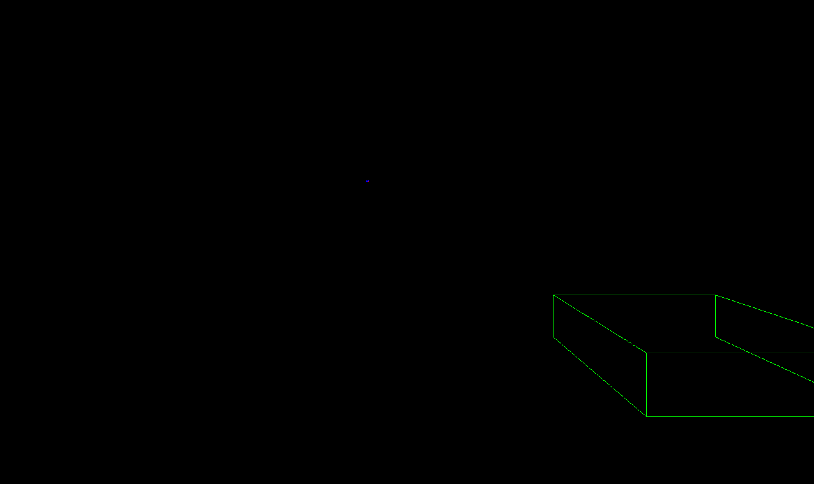
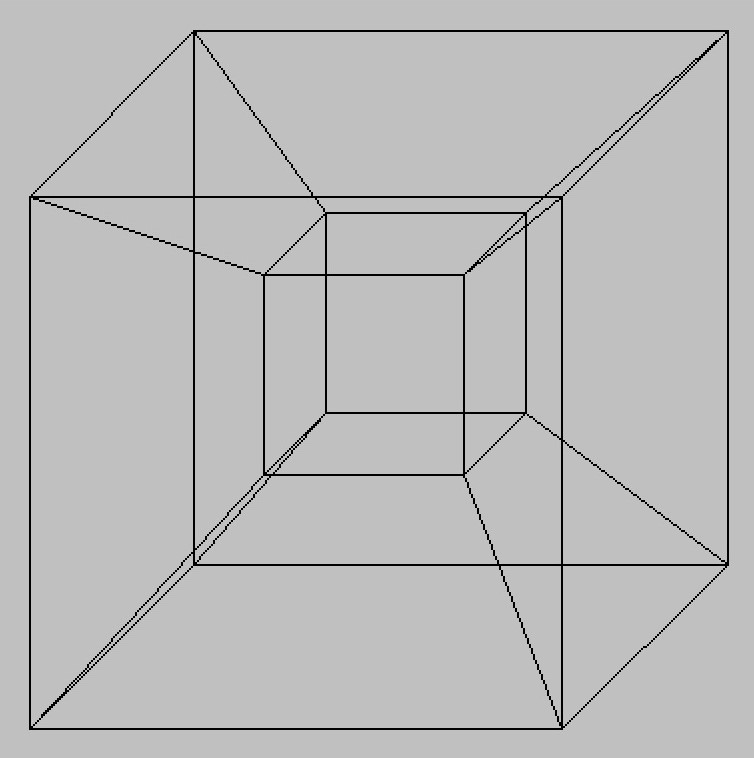
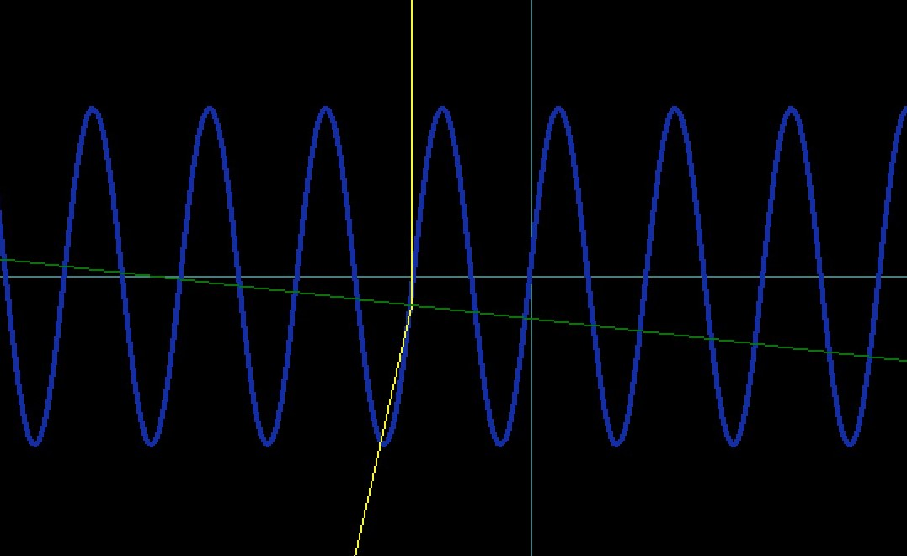
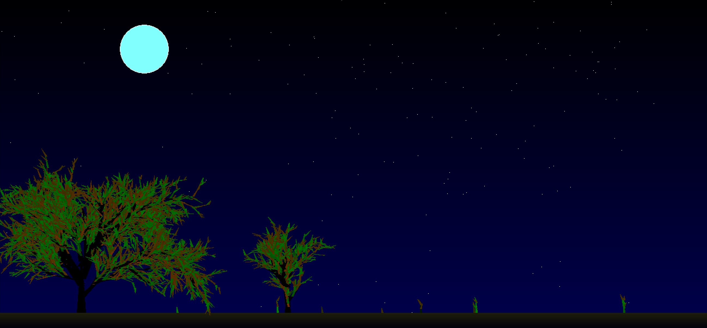

# Перші програми

## Зміст

+ Вступ
+ Передісторія
+ Перші програми
  + Як маючи плоский екран зобразити трьох вимірний світ?
+ Вища ланка еволюції 3D програм
+ Фізика
  + Скакання мячика по землі
  + Тертя
  + Гравітація
+ Інші програми
  + Генерація краєвиду
  + Більярд
  + Тести на додавання і віднімання
  + Перетворення Фурє
  + Крива Безє
  + Теплопровідність
  + Аеросила крила
  + Тригонометрія
  + Комплексні числа
+ На завершення

## Вступ

Програми які тут знаходяться мали величезний вплив на мене і ехо з тих часів, можна чути ще досі. Наприклад те, що я зараз вчуся на компютерній фізиці і намагаюсь присвятити цьому напрямку увесь свій час. Надалі намагатимусь описати передумови і деталі, щодо програм, а також спробую поділитися тею радістю, яку відчував, коли їх писав і духом відкриттів ;)

## Передісторія

На протязі мого дитинства мав змогу бачити, як компютери і смартфони поступово захопили моє місто. Перше моє знайомство з компютером було в місцевого сокальчанина, який мав підпільний ігровий клуб в себе в дома і погодинно здавав ігрові приставки і стаціонарний компютер. Був мабуть в 5-тому класі(2004 рік). Пізніше через кілька років, стаціонарний компютер зявився у мого зведеного брата. Тож я часто приходив і до нього подивитися "як він з друзями грає за компютером". В кінці дня також і мені щось перепадало. Також в нього перший раз побачив Adobe Photoshop мабуть 6-тої версії. 

Пройшло кілька років. Будучи вже в 8-ому чи то 9-ому класі, одного вечора прийшла посилка від моїх батьків заробітчан. Емоції зашкалювали! Адже поміж інших прекрасних і бажаних речей, був компютер! Та не просто стаціонарний компютер, а ноутбук! Радості не було меж. З того часу починається нова сторніка мого життя. 

Після недовгого часу потраченого на ігри(відносно не довгого), прийшов час більш серйозним програмам, а саме Sony Vegas, Adobe Photoshop, Virtual Dub, Pincale Studio, Hollywood FX і інші. Окремо варто зауважити WinAmp із його візуальними ефектами, які піддавались програмуванню. Оскільки в цей час ми займалися паркуром, то була необхідність займатися монтажем. Кілька відео:

[](https://drive.google.com/embeddedfolderview?id=1wJpBeVY-ARI8FIdYkzH1M1eXB17L-5SB#list)

Працювати із Sony Vegas - було суцільним задоволенням. З кожним разом відкриваєш для себе нові можливості цього інструменту. В якийсь момент в мене виникло питання: "А як все ж створюють ці всі програми?". Відповідь не заставила себе довго чекати. 

10-ий клас, перший урок інформатики, я підхожу до вчителя і питаю його про те, як пишуть програми. До цього, цей процес, я собі уявляв, як великі заводи з коменами з яких валить дим. І там тисячі людей в поті чола і бруді, переставляючи перемикачі створюють програми. Та вчитель, до мого здивування, сказав: "Ходімо до компютера, я тобі покажу..". І ось він відкрив, як пізніше дізнався, середовище Algo Pascal і вписав наступний код:

```pascal
Program MyProgram; 

Var 
   a,b: integer; 

Begin 
  Read(a); 
  Read(b); 
  Write(a + b); 
end.
```

Дивитися на виконання ціє програми вперше - було неймовірним! В цей момент мені здавалось, що перед мною відкрився цілий новий світ.

Це так і було. Одразу після цього я просижував цілі дні, пишучи програми для себе, а через два тижні вже був на олімпіаді з Інформатики і посів 2-е місце. Писав в основному програми на стику фізики і математики, що поглибило мої знання зі всіх цих предметів. За рік я вже зайняв 1-е місце на олімпіаді з Інформатики в районі, хоча й лише 15-е у області, а також 1-е місце в Сокалі з Математики. Далі поступив на Фізичний факультет в ЛНУ. Це був 2009 рік. Зараз навчаюсь на у Варшавському Університеті за спеціальністю Компютене і математичне моделювання процесів фізичних. Саме цікаво, що Algo Pascal була розроблена у Варшаві і ось за майже десятиліття знайомства із нею вона мене сюди привела і вказала напрям, чому я дуже вдячний.

## Перші програми

Algo Pascal має хорошу документацію і багато цікавих готових мініатюрних програм. 

Від самого початку мене цікавила фізика і симуляція фізичних процесів. А ціллю максимум була - симулюяція всього світу. Тоді ще не розумів, наскільки це не підйомна проблема. Також хороша симуляція має включати графіку, а ще краще 3D графіку.
На цих напрямах я і зусередився.

### Як маючи плоский екран зобразити трьох вимірний світ?

Пригадую мені зайняло день або два, щоб знайти відповідь на це питання. Мені здається, що відповідь ми можемо інтуїтивно зрозуміти, адже конструкція ока теж працює із проекцією трьох вимірного зображення на плоску сітківку. Роздумуючи над цим фактом, а теж тим, що предмети зменшуються при збільшенні відстанні і наоборот - займають ціле поле зору при мінімальній відстані до ока. Натрапив на наступну формулу. Для перетворення трьох просторих координат на дві координати екрану:

```
xp = x / (k*z)
yp = y / (k*z)
```

Парамет __k__ - відповідає за поле бачення.   
__x, y, z__ - просторові координати, а    
__xp, yp__ - координати двохвимірної проекції, тобто координати на екрані монітору.

І ось маленька програмка для тестування гіпотези:


[вихідний код](https://github.com/okmechak/MyOldPrograms/blob/master/AlgoPrograms/13-D!.pas)

Також треба важати на значення __z__, як видно з анімації(ділення на нуль). З анімації мабуть не так видно ефект трьох вимірності, як власною рукою спробувати порухати цим об'єктом. Але ілюзія трьох вимірів спрацювала!

Коли готовий основний прототип, подальше вдосконалення іде досить легко. 

Куб:


[вихідний код](https://github.com/okmechak/MyOldPrograms/blob/master/AlgoPrograms/3_dCub.pas)

Гра яка полягає з допомогою одного кубу лапати інший, хоча без тіней важко орієнтуватися в глибині:



[вихідний код](https://github.com/okmechak/MyOldPrograms/blob/master/AlgoPrograms/3dgame.pas)

Або ще можна намалювати куб із колів.
Тільки цього разу використана модифікована формула проекції:

```
xp = x/k/sqrt(x^2+y^2+z^2)
yp = y/k/sqrt(x^2+y^2+z^2)
```

Звідки й деформуються прямі грані куба.


[вихідний код](https://github.com/okmechak/MyOldPrograms/blob/master/AlgoPrograms/cRYTUCYB.pas)

І ще один приклад:


[вихідний код](https://github.com/okmechak/MyOldPrograms/blob/master/AlgoPrograms/3-dparalelepiped.pas)


А як на рахунок чотирьох вимірів?
Легко! Як бачимо з малюнку, проекція 4D кубу - це куб в кубі.
Хотя із певними умовками. В програмі була використана наступна формула:

```
xp = x/k/(z + t)
yp = y/k/(z + t)
```

де __t__ - це координата четвретого виміру. Хотя більш доцільною виглядає наступна формула:

```
xp = x/k/sqrt(x^2+y^2+z^2+t^2)
yp = y/k/sqrt(x^2+y^2+z^2+t^2)
```



[вихідний код](https://github.com/okmechak/MyOldPrograms/blob/master/AlgoPrograms/hypercub.pas)

## Вища ланка еволюції 3D програм

Набившись вдосталь із малими програмами по графіці, хотів створити програму, яка б помагала розвязувати задачі з геометрії, як от площа перерізу, чи то проекції, різноманітні симетрії і тд. Ці задачі досить популярні на Геометрії в останньому 11-ому класі. А ще я був надихнувся однією програмою, знайти яку нажаль невзмозі. 

Але перш ніж перейти до цих програм, треба вирішити одну проблему. Для простору є дуже зарактерним один вид переміщення, а саме __обертання__. До цього я мав справу лише із переміщеннями паралельними самим собі, тобто вздовж координат. Та обертання вимагають складнішого підходу. В той час - це було викликом для мене. І цей виклик був вирішений з допомогою такої частини математики, як __Тригонометрія__.

В школі мені як і багатьом, теж важко давалося розуміння Тригонометрії. Прилеглий кат, не прилеглий, синус, косинус.. було важко зрозуміти, для чого це. Та намагаючись запрограмувати реалістичний трьохвимірний простір, тригонометрія стала в нагоді як ніколи. І розуміння саме собою прийшло. 

Перший прототип обертання:


[вихідний код](https://github.com/okmechak/MyOldPrograms/blob/master/AlgoPrograms/rotaterectangle.pas)

Цей приклад базується на простій формулі і основних базових функція тригонометрії - __синус__ і __косинус__:

```
xr = r cos(alpha)
yr = r sin(alpha)
```

Не пригадую, щоб в школі акцентували на тому, що Тригонометрія повязана із обертанням. Говорили хіба, що вона повязана із колом. А це як на мене була дуже важлива, але упущена деталь. Також програмування дає змогу побачити інтерактив чи то динаміку, рух цих "фомул", що значно покращує розуміння. Теж стикався з подібною думкою з інших джерел.

Тепер ми маємо всі компоненти і можемо врешті зробити, повноцінну програму із багатьма опціями і цікавими налаштування! 


> програма настільки велика, що їй вже не влазить останні рядок з інструкцією ```end.```, тому його треба добавляти кожен раз.

[вихідний код](https://github.com/okmechak/MyOldPrograms/blob/master/AlgoPrograms/15EXPER.pas)

І ще складніша версія, написана в Delphi:


[посилання на програму](https://github.com/okmechak/MyOldPrograms/blob/master/AlgoPrograms/3DGeometry-Delphi/Project1.exe)

Нажаль через велику кількість налаштуваннь, я так і не зміг реалізувати всього задуманного.

## Фізика

Щож, розібрались із трьома вимірами і обертаннями. Тепер треба вдихнути життя в цей простір, тобто додати динаміку і закони природи - фізику.

З якоїсь причини в школі, фундаментальними законими мені здавалися наступні:

+ Тертя.
+ Коливання.
+ Гравітація.
+ Скакання мячика по землі.

Ці пункти, дуже дивні і поняття не маю, чому вибрав саме їх.

Зараз відомо наступні [фундаментальні взаємодії](https://uk.wikipedia.org/wiki/Фундаментальні_взаємодії): 

+ Гравітаційна.
+ Елетромагнітна.
+ Слабка.
+ Сильна.

Хоча в кінцевій теорії всього і намагаються обєднати ці чотири види, до лише однієї взаємодії. Та нажаль, тоді в школі, немав змоги про це знати.

### Скакання мячика по землі.

Це можна сказати класична задача механіки у Фізиці. Також приклад подібної задачі був вже в Алго, тож із нею було цікаво побавитися. Тіло будучи в однорідному полі тяжіння переміщається, за наступною формулою:

```
x = x0 + vx0*t + 1/2*g*t^2
y = y0 + vy0*t
```

Де __x0, y0__ - початкова позиція мячика, __vx0, vy0__ - початкова швидкість, __g__ - прискорення вільного падіння і __t__ - час.

При ударі мяча об землю, вертикальний вектор швидкості змінюється на протилежний:

```
vy -> -vy
```

Приклад програми:


[вихідний код](https://github.com/okmechak/MyOldPrograms/blob/master/AlgoPrograms/lasten2.pas)

Як можна бачити, другий раз мячик не відбивається. Що є помилкою в програмі.

Випадок із перепендикулярними стінками і відбиттям від них є дуже простими. Просто змінюємо напрямок швидкості на протилежний. Та все ускладнюється, коли зявляються похилі поверхні. І обрахування правильних напрямків після відбиття зайняло в мене багато часу. 

Кілька програм з помилками:


[вихідний код](https://github.com/okmechak/MyOldPrograms/blob/master/AlgoPrograms/linebo.pas)


[вихідний код](https://github.com/okmechak/MyOldPrograms/blob/master/AlgoPrograms/kulka.pas)


[вихідний код](https://github.com/okmechak/MyOldPrograms/blob/master/AlgoPrograms/kulka2.pas)

Та в якийсь момент, а саме мабуть на першому курсі університету, все ж навчився рахувати правильно кути відбиття. Наприклад від ось такої складної поверхні:



[вихідний код](https://github.com/okmechak/MyOldPrograms/blob/master/AlgoPrograms/Vidbuttia.pas)

Що в свою чергу помоголо реалізувати повноцінне скакання мячика на будь якій поверхні. В наступному прикладі, кульки зєднані між собою уявними кольоровими лініми, що створює красиві малюнки їхньої траєкторії: 


[вихідний код](https://github.com/okmechak/MyOldPrograms/blob/master/AlgoPrograms/Vidbuttia.pas)

### Тертя

Це теж класична задача 9-го класу з Механіки. Одна з найскладніших проблем, була намалювати паралелепіпед на похилій поверхні, що вимагало знання Тригонометрії(про що вже йшлося вище). Закони руху подібні до мячика в однорідному полі, з тою різницею, що рух бруска відбувається лише на поверхні - тобто в одному вимірі.


[вихідний код](https://github.com/okmechak/MyOldPrograms/blob/master/AlgoPrograms/Law/FTertiaended.pas)


### Гравітація

Була спроба реалізувати справжню Нютонівську гравітація. Та нажаль був получився світ без інерції, що вилилось в набагато простішу динаміку:


[вихідний код](https://github.com/okmechak/MyOldPrograms/blob/master/AlgoPrograms/gravitation.pas)

## Інші програми

ТУДУ додати опис до кожної іх програм.

### Генерація краєвиду




[вихідний код](https://github.com/okmechak/MyOldPrograms/blob/master/AlgoPrograms/Fractals/derevo.pas)

### Більярд


[вихідний код](https://github.com/okmechak/MyOldPrograms/blob/master/AlgoPrograms/BBBBB1.pas)

### Тести на додавання і віднімання


[вихідний код](https://github.com/okmechak/MyOldPrograms/blob/master/AlgoPrograms/dodavnniaividnimannia.pas)

### Перетворення Ферє


[вихідний код](https://github.com/okmechak/MyOldPrograms/blob/master/AlgoPrograms/furje.pas)

### Крива Безє


[вихідний код](https://github.com/okmechak/MyOldPrograms/blob/master/AlgoPrograms/kruvalinija.pas)

### Теплопровідність


[вихідний код](https://github.com/okmechak/MyOldPrograms/blob/master/AlgoPrograms/teploprovidnist.pas)

### Аеросила крила


[вихідний код](https://github.com/okmechak/MyOldPrograms/blob/master/AlgoPrograms/aerosulacrula.pas)

### Тригонометрія


[вихідний код](https://github.com/okmechak/MyOldPrograms/blob/master/AlgoPrograms/trugonometria.pas)

### Комплексні числа


[вихідний код](https://github.com/okmechak/MyOldPrograms/blob/master/AlgoPrograms/coplexmassive.pas)


## На завершення

Хотів подякувати за перегляд.

В цій статті я лише висвітлював зі субєктивної точнки зору свої враженняю, думки, роздуми про те, як виглядав мій шлях і вплив тих чи інших речей. І якщо ви знайшли, в цьому тексті щось близьке для себе, тобто моя субєктивна точка співпаде із Вашою, то це вже крок на зустріч так бажаної обєктивності.