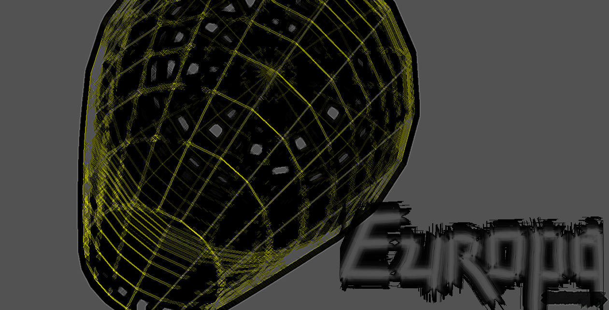
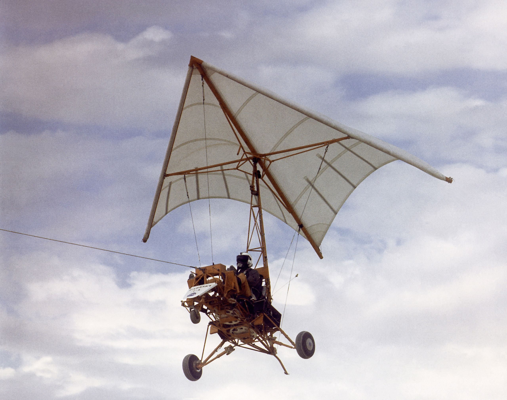
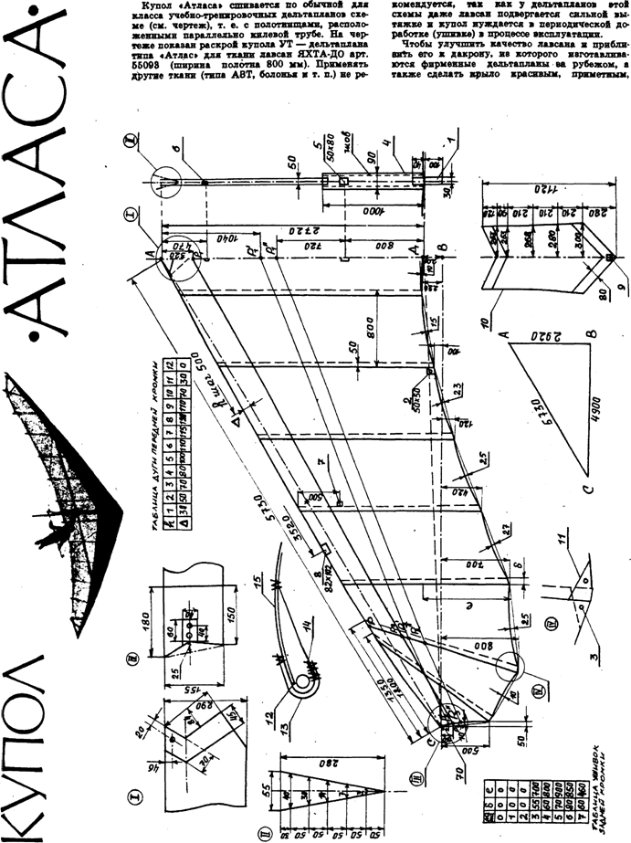
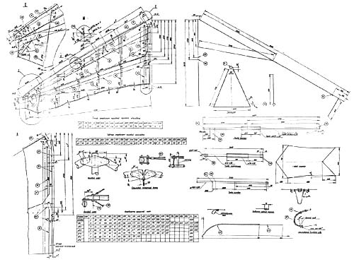
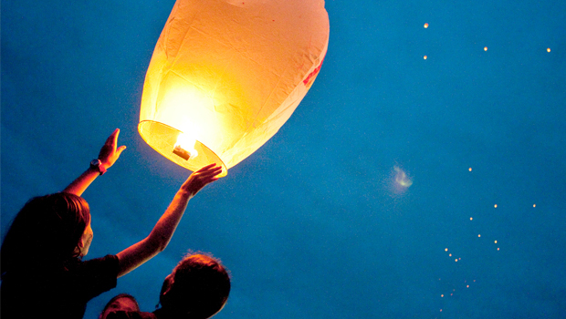
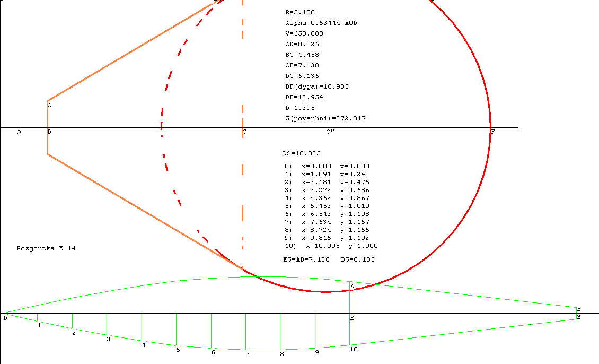
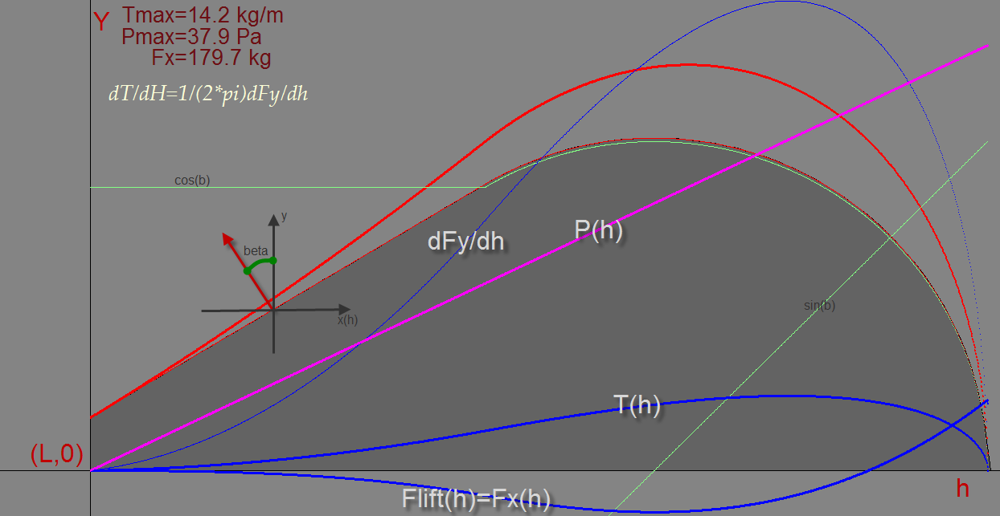

# Повітряна куля: Сонячний День(Sunday).

Повітряна куля - це літальний апарат, який легший за повітря. Повітряна куля, як і кусочок пінопласту який спливає на поверхню води, взлітає вверх, допоки атмосфера не стане настільки розрідженою, що вже не зможе вище виштовхнути її. Густина повітряної кулі в середньому повинна бути меншою від повітря довкола.

__Так, спочатку хотів назвати кулю Europa, та пізніше назва всеж була змінена на Sunday.__

## Передісторія

Ще в дитинстві, як вітчим розказав мені про принцип дії крила, а пізніше ми і сконструювали невеличкий літачок, від думок про літання я вже не міг відійти. Багато просижував в бібліотеці читаючи про аеродинаміку, NASA, дельтаплани та інше, Хоч нажаль не багато з того розумів. 

В якийсь момент вирішив, що пора діяти і дельтаплани здавалися "найпростішими" в реалізації. Знайшов кілька моделей:
- Модель 1962 року [__Paresev__](https://en.wikipedia.org/wiki/NASA_Paresev). Хотя насправді йдеться про радянську весрію, яку я не зміг знайти тепер в інтернеті. 
- Навчальний дельтапан __Атлас__. Складніший в конструкції і з кращими характеристиками. 
- Дальтаплан __Тайфун__, який до того ж міг бути моторним і теж мав креслення в інтернеті. 

Розібравшись із кресленнями і поробивши невеличкі моделі, зі штапіків, поліетиленової плівки та скотчу, почав шукати матеріали для повномаштабної версії. Та тут мене спіткали труднощі, які не зміг здолати на той момент. Алюмінієвих(або дюралюмінієвих) труб з відповідними діаметром і довжиною не було в продажі. Матеріал для латів(невеличкі трубки, які наче пальці в кажана вставляються в крило) теж не міг знайти. Проект зупинився..

Минуло не багато часу, як дивлячись передачу на National Geographic про традицію запускати небесні ліхтарики на воді мене осяйнуло, що більш дешевим, легшим і швидшим буде зробити саме повітряну кулю! 

Тут і починається цей проект.

Спочатку треба все детально спроектувати, а тому було написано кілька програм в Pascal для цього:

- [balloon.pas](https://github.com/okmechak/Hot-Air-Balloon/blob/master/baloon.pas) - проектування креслення кулі, задавання деяких базових параметрів.
- [pascal.pas](https://github.com/okmechak/Hot-Air-Balloon/blob/master/pascal.pas) - вираховує фізичні нагрузки на кулю і саме основне її вантажопідйомність.
- [3D_model.pas](https://github.com/okmechak/Hot-Air-Balloon/blob/master/3D_Model.pas) - Використовується для 3D візуалізації моделі.

## Sunday

Після етапу проектування, я оприділився із кількома важливими параметрами кулі, це мала бути:

- __Одномісна куля__. Оскільки чим менша маса, тим легше її зробити.
- __Підйомна маса__ - __180 кілограм__. Взято із запасом
- І __об'єм__ після проектування - __650 метрів кубічних__. Що відповідало 16 метрам висоти!

Деякі параметри також тут є:

- [info.txt](https://github.com/okmechak/Hot-Air-Balloon/blob/master/Type-A14-Sunday/info.txt)
- [main-parameters.txt](https://github.com/okmechak/Hot-Air-Balloon/blob/master/main%20parameters.txt)
- [Money-And-Tools.txt](https://github.com/okmechak/Hot-Air-Balloon/blob/master/Type-A14-Sunday/Money-and-Tools.txt)

## Проектні креслення і обрахунки

### Геометрія

### Фізичні сили

### Схема кроєння поліетилену

### 3D модель 

+ трішки фотошопу :wink:

## Математика і фізика повітряної кулі

Не дарма в більшость людей сильний страх висоти. Падіння з висоти є смертельно небезпечним для нас. А тому повітряна куля повинна бути настільки надійною, наскільки це можливо. Та як цього досягнути, не тестуючи її безпосередньо на собі і не ризикуючи свої життям? 

Далі буде...

## Чому саме Sunday

## Роздуми про те, чому проект впав.